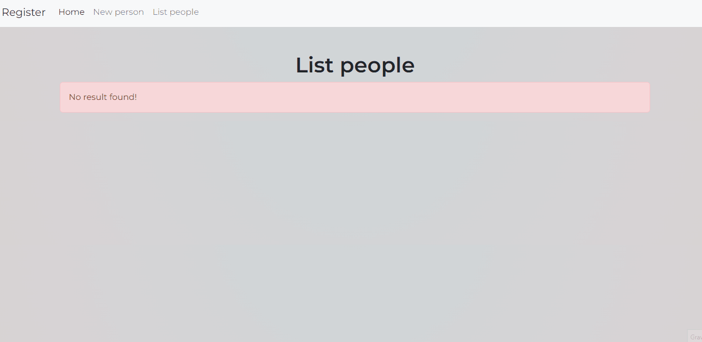

# CRUD People
<h1 align="center">
    
</h1>

# Descrião
Projeto com intuito de praticar e exercitar conceitos de HTML, Bootstrap, PHP e Banco de Dados.
Este projeto conta com formulários que possuem requests, utilizando o PHP para receber os dados e armazenar no banco de dados (phpMyAdmin), contando com opções de criar, editar e deletar. O projeto também conta com uma estilização utilizando Bootstrap.

# Construído com
 - **HTML - HTML** (Linguagem de Marcação de HiperTexto) é o bloco de construção mais básico da web. Define o significado e a estrutura do conteúdo da web.
 - **Bootstrap - Bootstrap** Bootstrap é um framework web com código-fonte aberto para desenvolvimento de componentes de interface e front-end para sites e aplicações web
 - **PHP - PHP** PHP é uma linguagem interpretada livre, usada originalmente apenas para o desenvolvimento de aplicações presentes e atuantes no lado do servidor.
 - **phpMyAdmin - phpMyAdmin** phpMyAdmin é um aplicativo web livre e de código aberto desenvolvido em PHP para administração do MySQL pela Internet.

## Status do Projeto
**Concluído:** O projeto já foi finalizado.

## Autor
- **Desenvolvimento: Leonardo Borges** - Responsável pelo desenvolvimento da página;
